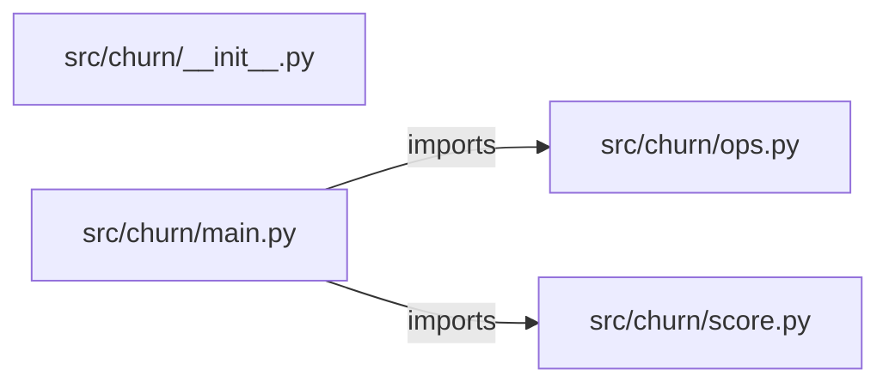

# customer-churn-prediction — project architecture

[README](README.md) · [Interview questions and answers](INTERVIEW_QA.md)

## Purpose and scope

`data/customers.csv` has 24 customers with tenure, monthly charges, support tickets, and whether they churned. Every fourth row is held out. The model is logistic regression trained by gradient descent on standardized features with a small L2 penalty, so the weights are learned from data rather than typed in.

This document describes files and symbols in this checkout. Deployment templates and statements in the original overview are distinguished from a verified running environment.

## Component diagram



For Python repositories, arrows show resolved local imports, not network calls or deployment order. Otherwise the diagram is a repository component map; containment arrows do not assert runtime integration.

## Components and responsibilities

| Component | Responsibility |
| --- | --- |
| [`src/churn/main.py`](src/churn/main.py) | HTTP handlers: `GET /healthz`, `GET /model`, `POST /score`, `POST /score/batch` |
| [`src/churn/ops.py`](src/churn/ops.py) | HTTP handlers: `GET /readyz`, `POST /workspaces`, `GET /workspaces`, `POST /workspaces/{workspace_id}/jobs`, `GET /jobs/{job_id}` |
| [`src/churn/score.py`](src/churn/score.py) | Functions: `sigmoid`, `load`, `split`, `train`, `explain`, `evaluate`, `model` |
| [`requirements.txt`](requirements.txt) | Implementation or supporting configuration |
| [`src/churn/__init__.py`](src/churn/__init__.py) | Implementation or supporting configuration |
| [`Dockerfile`](Dockerfile) | Container build/service configuration |
| [`Makefile`](Makefile) | Implementation or supporting configuration |
| [`docker-compose.yml`](docker-compose.yml) | Container build/service configuration |
| [`tests/test_churn.py`](tests/test_churn.py) | Executable checks and regression examples |
| [`tests/test_ops.py`](tests/test_ops.py) | Executable checks and regression examples |
| [`.github/workflows/ci.yml`](.github/workflows/ci.yml) | GitHub Actions job definitions |
| [`README.md`](README.md) | Project explanations or operating notes |
| [`docs/ARCHITECTURE.md`](docs/ARCHITECTURE.md) | Project explanations or operating notes |

## Existing design and operating guides

These checked-in guides provide the project’s detailed design, operational context, or deployment view:

- [`docs/ARCHITECTURE.md`](docs/ARCHITECTURE.md).

## Request interface

| Method and path | Handler | Source |
| --- | --- | --- |
| `GET /healthz` | `healthz` | [`src/churn/main.py`](src/churn/main.py#L11) |
| `GET /model` | `get_model` | [`src/churn/main.py`](src/churn/main.py#L16) |
| `POST /score` | `post_score` | [`src/churn/main.py`](src/churn/main.py#L26) |
| `POST /score/batch` | `post_batch` | [`src/churn/main.py`](src/churn/main.py#L35) |
| `GET /readyz` | `readyz` | [`src/churn/ops.py`](src/churn/ops.py#L44) |
| `POST /workspaces` | `create_workspace` | [`src/churn/ops.py`](src/churn/ops.py#L49) |
| `GET /workspaces` | `list_workspaces` | [`src/churn/ops.py`](src/churn/ops.py#L66) |
| `POST /workspaces/{workspace_id}/jobs` | `create_job` | [`src/churn/ops.py`](src/churn/ops.py#L73) |
| `GET /jobs/{job_id}` | `get_job` | [`src/churn/ops.py`](src/churn/ops.py#L96) |
| `POST /jobs/{job_id}/approve` | `approve_job` | [`src/churn/ops.py`](src/churn/ops.py#L105) |
| `GET /audit` | `audit` | [`src/churn/ops.py`](src/churn/ops.py#L122) |
| `GET /metrics` | `metrics` | [`src/churn/ops.py`](src/churn/ops.py#L138) |

The table lists literal route decorators found in the inspected Python modules. Router prefixes and middleware can add behavior; check the linked handler and application setup before calling an endpoint.

## Implementation walkthrough

### `train(rows, epochs=3000, rate=0.1, l2=0.01)`

Source: [`src/churn/score.py`](src/churn/score.py#L31).

Calls visible in this function: `dict`, `enumerate`, `len`, `math.sqrt`, `range`, `sigmoid`, `sum`, `zip`.

```python
def train(rows, epochs=3000, rate=0.1, l2=0.01):
    stats = {}
    for name in FEATURES:
        values = [row[name] for row in rows]
        mean = sum(values) / len(values)
        std = math.sqrt(sum((v - mean) ** 2 for v in values) / len(values)) or 1.0
        stats[name] = (mean, std)
    xs = [[(row[name] - stats[name][0]) / stats[name][1] for name in FEATURES] for row in rows]
    ys = [row["churned"] for row in rows]
    weights = [0.0] * len(FEATURES)
    bias = 0.0
    count = len(rows)
    for _ in range(epochs):
        grad_w = [l2 * w for w in weights]
        grad_b = 0.0
        for x, y in zip(xs, ys):
            error = sigmoid(bias + sum(w * v for w, v in zip(weights, x))) - y
            grad_b += error / count
            for i, value in enumerate(x):
                grad_w[i] += error * value / count
        weights = [w - rate * g for w, g in zip(weights, grad_w)]
        bias -= rate * grad_b
```

The excerpt is truncated; the linked source contains the full implementation.

### `evaluate(model, rows, threshold=0.5)`

Source: [`src/churn/score.py`](src/churn/score.py#L65).

Calls visible in this function: `explain`, `len`, `round`, `sigmoid`.

```python
def evaluate(model, rows, threshold=0.5):
    tp = fp = tn = fn = 0
    for row in rows:
        predicted = sigmoid(explain(model, row)[0]) >= threshold
        actual = row["churned"] == 1
        tp += predicted and actual
        fp += predicted and not actual
        tn += not predicted and not actual
        fn += not predicted and actual
    precision = tp / (tp + fp) if tp + fp else 0.0
    recall = tp / (tp + fn) if tp + fn else 0.0
    return {
        "accuracy": round((tp + tn) / len(rows), 4),
        "precision": round(precision, 4),
        "recall": round(recall, 4),
        "confusion": {"tp": tp, "fp": fp, "tn": tn, "fn": fn},
        "rows": len(rows),
    }
```

### `score(customer, threshold=0.5)`

Source: [`src/churn/score.py`](src/churn/score.py#L101).

Calls visible in this function: `InputError`, `abs`, `contributions.items`, `explain`, `isinstance`, `model`, `round`, `sigmoid`, `sorted`, `validate`.

```python
def score(customer, threshold=0.5):
    if not isinstance(threshold, (int, float)) or not 0 <= threshold <= 1:
        raise InputError("threshold must be from 0 to 1")
    validate(customer)
    logit, contributions = explain(model(), customer)
    probability = sigmoid(logit)
    factors = sorted(contributions.items(), key=lambda item: abs(item[1]), reverse=True)
    return {
        "probability": round(probability, 4),
        "label": "high" if probability >= threshold else "low",
        "threshold": threshold,
        "factors": [{"feature": name, "contribution": round(value, 4), "direction": "raises" if value > 0 else "lowers"} for name, value in factors],
    }
```

### `explain(model, customer)`

Source: [`src/churn/score.py`](src/churn/score.py#L56).

Calls visible in this function: `contributions.values`, `sum`.

```python
def explain(model, customer):
    contributions = {}
    for name in FEATURES:
        mean, std = model["stats"][name]
        contributions[name] = model["weights"][name] * (customer[name] - mean) / std
    logit = model["bias"] + sum(contributions.values())
    return logit, contributions
```

## Validation and failure paths

| Explicit exception | Source |
| --- | --- |
| `HTTPException(status_code=422, detail='customers must be a list of 1 to 1000 items')` | [`src/churn/main.py`](src/churn/main.py#L39) |
| `HTTPException(status_code=422, detail=str(exc))` | [`src/churn/main.py`](src/churn/main.py#L31) |
| `HTTPException(status_code=422, detail='each customer needs a string id')` | [`src/churn/main.py`](src/churn/main.py#L42) |
| `HTTPException(status_code=422, detail=str(exc))` | [`src/churn/main.py`](src/churn/main.py#L46) |
| `HTTPException(status_code=404, detail='workspace not found')` | [`src/churn/ops.py`](src/churn/ops.py#L77) |
| `HTTPException(status_code=404, detail='job not found')` | [`src/churn/ops.py`](src/churn/ops.py#L100) |
| `HTTPException(status_code=404, detail='job not found')` | [`src/churn/ops.py`](src/churn/ops.py#L109) |
| `HTTPException(status_code=403, detail='production apply is disabled in this lab')` | [`src/churn/ops.py`](src/churn/ops.py#L113) |
| `InputError('threshold must be from 0 to 1')` | [`src/churn/score.py`](src/churn/score.py#L103) |
| `InputError(f'{name} must be a number from {low} to {high}')` | [`src/churn/score.py`](src/churn/score.py#L98) |

These are explicit exceptions in the inspected source, rather than a claim that every failure is handled. Follow the calling handler to see whether the exception becomes an HTTP response or propagates.

## Data and state

- [`src/churn/ops.py`](src/churn/ops.py) defines module-level containers: `_WORKSPACES`, `_JOBS`, `_AUDIT`, `_METRICS`.
- [`src/churn/score.py`](src/churn/score.py) defines module-level containers: `LIMITS`.

Module-level dictionaries/lists live in a Python process. They can be fixtures or mutable state; inspect writes before treating them as persistent storage. A production extension would need to define persistence and concurrency behavior explicitly.

## Data flow and design decisions

### What is the input-to-output contract of `train`

In [`src/churn/score.py`](src/churn/score.py#L31), `train(rows, epochs=3000, rate=0.1, l2=0.01)` receives the inputs. The function computes these intermediate values:

- `stats = {}`
- `xs = [[(row[name] - stats[name][0]) / stats[name][1] for name in FEATURES] for row in rows]`
- `ys = [row['churned'] for row in rows]`
- `weights = [0.0] * len(FEATURES)`
- `bias = 0.0`
- `count = len(rows)`

Its result is defined by:

- `{'bias': bias, 'weights': dict(zip(FEATURES, weights)), 'stats': stats}`

### What does the operations plane add, and where is its limit

[`src/churn/ops.py`](src/churn/ops.py) declares `GET /readyz`, `POST /workspaces`, `GET /workspaces`, `POST /workspaces/{workspace_id}/jobs`, `GET /jobs/{job_id}`, `POST /jobs/{job_id}/approve`, `GET /audit`, `GET /metrics`. Inspect the application’s `include_router` call for its URL prefix.

Its state containers are `_WORKSPACES`, `_JOBS`, `_AUDIT`, `_METRICS`. The job-approval handler defines whether a target is accepted or refused; check that branch and the associated tests instead of treating a recorded job as a successful infrastructure apply.

## Setup and verification

The following commands are derived from the checked-in dependency/test contracts. Execute them from the repository root; the block prepares a local environment, not a cloud deployment.

```bash
python3 -m venv .venv
source .venv/bin/activate
python -m pip install -r requirements.txt
python -m pytest -q
```

Python dependencies: [`requirements.txt`](requirements.txt).

Test entry points: [`tests/test_churn.py`](tests/test_churn.py), [`tests/test_ops.py`](tests/test_ops.py).

Automation definitions: [`.github/workflows/ci.yml`](.github/workflows/ci.yml). Read their triggers and job steps to determine what CI actually runs.

## Operating boundaries and design review

Before turning this checkout into a customer deployment, establish the input contract, data ownership, access controls, failure response, evaluation criteria, and rollback owner. Repository fixtures and unit tests demonstrate local behavior; they do not establish throughput, uptime, compliance, or business impact.

A useful architecture review starts with the linked implementation: identify where input enters, where a decision is made, which state can change, and which external dependency can fail. Add a deployment view only for infrastructure that is actually configured and exercised.
